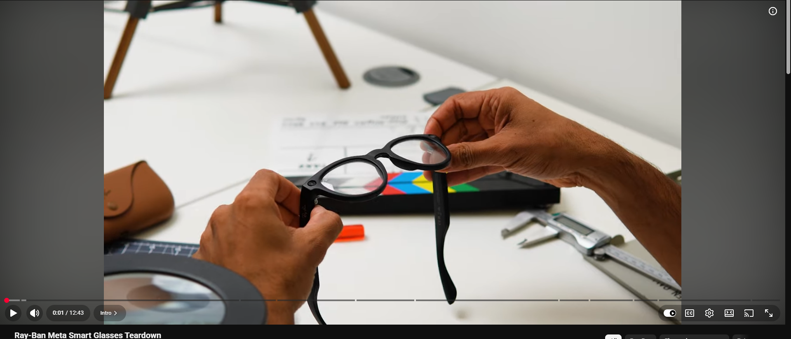
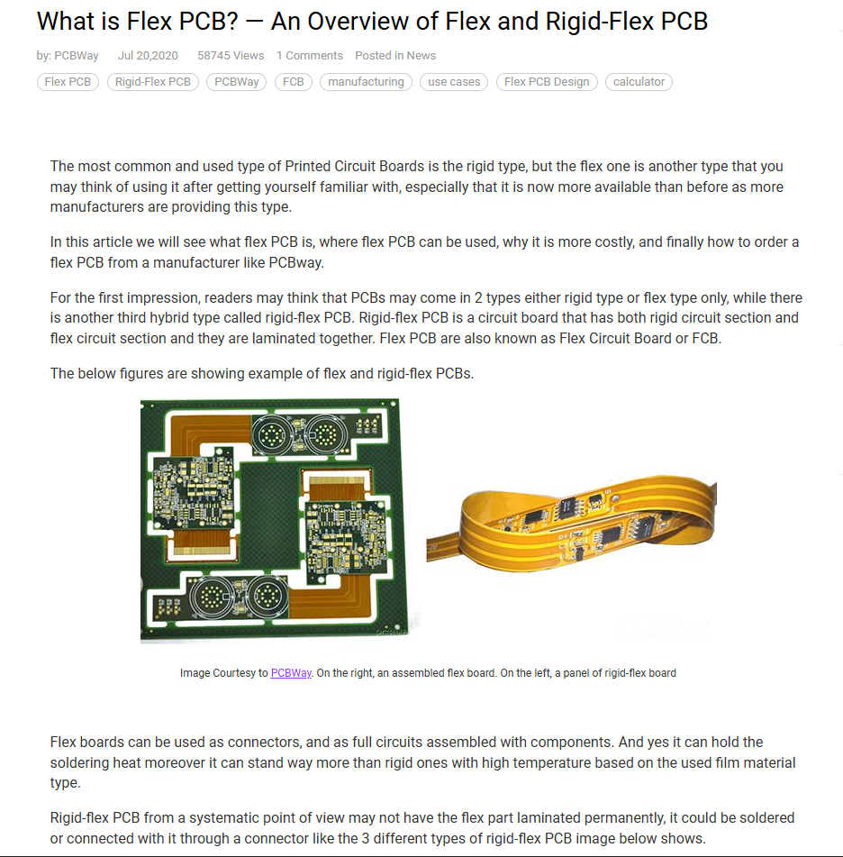

| Date started: May 21, 2026

# Pagtingin V2
Okay. I think it is time to start working on this project again. It's been literally almost a year since I've touched this project and all I can say is that I've changed a lot in those years. Now, we're back in Summer 2026 to work on this.

I guess to start, I would like myself to check up on why I gave up on this in the first place
- Clearly, it failed because I switched the positions of the pins of the MCU. So technically, I was quite literally trying to make it work but I had swapped the footprint pins to connect to different signals that weren't actuallly  the right footprint pins in thea actual footprint. Okay, so to explain on it much simpler, I switched each pins of the footprints to make routing easier. however, in the adctual footprint, no pins are switched, making the signals i've connected not corresponding to the actual footprint.

So that is definitely one problem, I would say.

Here's the complete list of problems that I noticed while making the PCB

1. Both PCBs were INCREDIBLY messy as hell. There were so many wires going through each of them, and it just didnt look good.
2. How the hell do you even program an ESP chip? This were mainly one of the main reasons why everything became messy
3. Some things weren't available when I asked JLCPCB to  solder all of the parts in the PCB. Also yeah, my soldering was js plain messy
4. Didn't account for some measurement of the 3d print
5. 3d printed glasses' hinges didn't work
6. And of course, the ESP32's footprint layout was wrong.

Clearly, there were so many problems here because I was so rushed into making this for Highway. But worry not, I'll try to fix them this summer.

## First Problem: How to program the ESP32-PICO-D4
I guess the first thing I can start working on is how would you even try programming the ESP32-PICO-D4 if its just a sole chip?

To program it you would need to use a USB-TO-UART bridge and programming it via the Arduino IDE.

I guess also one of the main reasons why we couldnt program the ESP32-PICO-D4 was that the pogo pins didn't fit the holes.
- This was also to me messing with the footprint's sizes.

So apparently the ESP32-PICO-D4 uses a UART bootloader mode in which it allows for firmware to be flashed over the serial communication protocol, UART.
- For this project, I think we can keep the FT2232HL-Based flashing

## Second Problem: How to know if the power delivery is working?
We test with the current version and see with a multimeter tester if the power delivery is indeed working as intended.

## Third problem: 3D Printed Hinges
The temples were okay and the PCB was able to fit but the problem was that the hinges didn't quite connect with each other.

We would probably need to add little tweaks to the 3D print and most likely try to see if it shall work.

I'll research on the META glasses how did they fit PCBs in their frames.

Going through the teardown of the meta rayban glasses, I noticed that they use a lot of flex PCBs. Flex PCBs, frankly, are quite a foreign term for me.
But as I understand, they are more of like

Quick notes:
- All the frames and the arms are made of plastic (NOT 3D PRINTED)
- Flex PCBs are more of used to houses the sensors such as proximity and light

So clearly, that teardown had my head not working anymore. I feel so overwhelemd redesigning all of this, so I think here are a couple of suggestions to make this project much less complex.

1. Use a ESP32 Module instead of the chip
2. Use templates from websites such us thingiverse and merge them with my current design
3. Sanity check from people

# Entry 01 - 05-27-26 - Starting with reducing the complexity of the project

Okay, ever since I've found out how complex this project was, I've always kept pushing that all will be fine and that I'd be able to get this done easily.

However, I don't think I can do that anymore. It's finally time.

Here were some problems things that I thought would be increasing the complexity of my project:
1. The microcontroller as a chip
2. FFC connectors 

First let's solve the problem of the microcontroller being a chip
- Honestly, trading it for the size, I just dont think I'll be replacing the chip for a devboard or whatever

FFC and FPC connectors
- I think it would be better if I got flex pcbs so that it can travel within the temple, frame, and temple pretty easily.

Studying the meta glasses teardown, apparently the way the two temples are connected to each other is this order:
Any temple -> hinge -> front frame PCB (in between in the lenses)

And then basically the front frame PCB connects both temple's pcb
- I have no idea how I am going to ever reach that level of making a pcb

For meta glasses the way they do is that:
- Two halves of a temple are glued together

According to GPT, the best way to connect the two boards is to use a Flex PCB.
Another very bad problem is that the 3d print isnt hollow.

Also for today, I tried to restore my files.

Anyways for the next journal, I plan to change up the 3D  Model. I think the PCB couldve been way better if I changed up that.