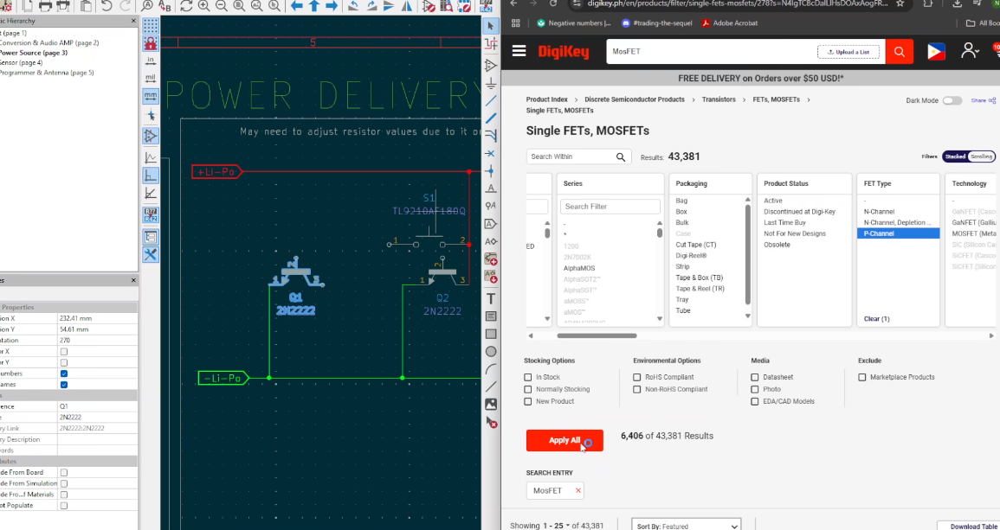

DISCLAIMER: I had been working on this project even before Highway. I had a prototype V1 beforehand. However, most of the CAD and PCB Making happened during the duration of Highway.

| Date started: March 17, 2025 

Total hours spent (according to notes): 
81 Hours

P.S. These were all my notes taken in Obsidian. Some of them are linked to other pages.

## March

# Entry #0 - 03-17-25
This was the start of me turning my prototype into an actual PCB

Next steps:
- Try to research if I could make the current circuit into  a microchip
-  Sub project (Try to make an earphone in order to make sense of the project)
- Try to somehow integrate electromagnetism with the project 
- Research on how to integrate AI such as Tensorflow Lite and TinyML
- Physics concept
	- Doppler effect
	- Echolocation

Different Research:
- Making microchips:
	- https://www.instructables.com/Make-Your-Own-Microchips/
- Making earphones
	- https://www.instructables.com/DIY-Headphones-2/
- Doppler Effect:
	- https://www.grc.nasa.gov/www/k-12/airplane/doppler.html

Image 1. First Steps of my project

Total time spent: 2 hours

# Entry #1 - 03-20-25: Research

Types of Speakers

Headphones tech: driver units
- A driver unit is the most important component in headphones
- A mini speaker in headphones that converts electrical signals through the headphone wire into audible sound

Components of a headphone driver unit
- Magnets
	- Helps improve its sound quality
	- Made of cobalt, ferrite, and more
- Voice coils
	- Produce quality sound feature voice coils made of PCOCC
- Diaphragm
	- Usually, the larger the diameter, the better sound quality seems to be

Types of headphone driver units
- Dynamic drivers
	- Most common and cheapest drivers which use larger diaphgrams
	- Use magnetism and electromagnetism
	- Popular for headphones,, loudspeakers, and earbuds
- Balanced Armature
	- Much smaller and incredibly power efficient
- Planar magnetic
	- Most high-end headphones and earphones use planar magnetics
- Electrostatic
	- Uses an electrically charged diaphragm 
	- Produces exceptional sound quality

Types of Audio Drivers

Bone Conduction Transducer
- Small speaker that does not have a moving cone
- It works electromagnetically since when current flows them magnetic field will expand and contract

Audio exciter
- A sound exciter is a loudspeaker without frame and cone

How does an exciter work?
- Comprised of motor assembly, a voice coil, and a suspension system

Why use an exciter?
- Provides a universal, cost-effective alternative to loudspeakers, allowing for sound reproduction

Where to use an exciter?
- The surfaces themselves will affect how the sound exciter will react in an individual application
	- For example, mounting an exciter onto glass will provide a much different sound than mounting them in a foam of core

Types of exciters
- Coin type
	- Less  than an inch in size
	- Perfect for compact areas where space is limited
	- Oftenly used in toys, monitors, small glass enclosures
- Bone Conducting
	- Converts electrical signal to mechanical vibrations so that it stimulates the bones in the ear
- High Power
	- For increased sound performance
- Extended Mount
	- For projects featuring a larger mounting surface

Are they better than normal speakers?
- It depends.

Total time spent: 3 hours

# References
- https://www.instructables.com/Adafruit-Bone-Conduction-Speaker/
- https://www.daytonaudio.com/topic/excitersbuyerguide

# Entry #2 - 03-21-25: Looking for some components

Microprocessor:
- ESP32-PICO-D4
- Antenna (Need one since the microprocessor does not have it)

Audio Amp:
-  PAM8403DR 
- DAC:
	- PCM5102APWR
- Speaker:
	- MEMS speaker

- [ ] 

Power source
- [[Pagtingin Study -Best Batteries and Use Case - 03-22-25]]

In general:
- SMD (Capacitors, diodes, resistors, etc): [[Pagtingin Study - SMD to use - 03-23-25]]

Sensor:
- TOF Sensor:
	- https://www.mouser.com/datasheet/2/389/vl53l3cx-1799823.pdf

Antenna
- Just add a footprint with a PCB antenna

Debugger and programmer:
- The ESP-PROG with the programmer and JTAG interface

Total time spent: 2 hours

# Entry #3 - 03-22-25: Research on Best batteries and Use case:

Alkaline Batteries
- Usually not rechargable

Rechargable batteries

In general, rechargeable batteries are rechargeable since they have much more chemical reactance. 
- Lithium polymer
	- Requires an extra circuit to prevent overcharging
	- Value is 2500 mAh rated at 3.7V
	- Range of the ESP32-PICO-D4: -0.3V, max 3.6V
	- Range of the TOF sensor chip: 3-5V
	- Range of the DAC chip: 2.5V - 5.5V
	- Range of the Audio AMP: 2.5 - 5.5 V
- NiMH cells
	- Runs on 1.3V or 1.5V

Well for the lithium polymer, this will greatly depend on the needed power of the other components. (Sensor,  audio amp,)

For the glasses project:
- Buck converter to amplify voltages for certain chips

USB IN Module:
- A USB receptacle type C for charging
	- ??
- We need the battery which i chose to be a Li-Po battery
- A battery management chip 
	- TP4056 Works well
	- NTC Thermistor for the TEMP PIN

Individual researches:
- USBs: [[Pagtingin Study -USB C vs Micro USB for Power - 03-22-25]]
- Battery management chip: [[Pagtingin Study -Battery Management Chips - 03-22-25]]
- Power Flow Management: [[Pagtingin Study - Power Management and Flow - 03-24-25]]
- Voltage Supervising & Protection Circuit: N/A

Image 2. Reading Datasheets

Total time spent: 3 hours

# Entry #4 - 03-23-25: Searching for SMD Components

Resistors
- 0805  resistor
- https://www.digikey.ph/en/products/filter/chip-resistor-surface-mount/52?s=N4IgTCBcDaIAwA44FYQF0C%2BQ

Diode:
- MBR120VLSFT1G ofor the power supply so current doesnt go backwards
- SS34 for the schottky diode

Capacitors model:
- 0603
- https://www.digikey.ph/en/products/filter/ceramic-capacitors/60?s=N4IgTCBcDaIAwDY4GYQF0C%2BQ

Transistor
- MOSFET (This is for the power unit of the circuit)
	- Try out the LFPAK56

Total time spent: 1 hour

### -- INCOMPLETE --

## APRIL

## IMAGES OF APRIL WORK

Image 3. Working with the PAM8403 Audio Amp Chip - 04-06-25

Total time spent: 4 hours

Image 4. Working with the ESP32-PICO-D4 - 04-07-25

Total time spent: 3 hours

# Entry #5 - 04-13-25: Total and Peak Current of Components Chosen:

ESP32-PICO-D4
- Bluetooth (RF functionality)
	- TX
		- Peak current for transmitting power is 370mA
		- Recommendation: a battery should be able to supply short bursts of at least 400mA
	- RX:
		- Peak current: 120mA
- GPIOs
	- Typical current: depends on what we connect it to
	- Peak current (max current a gpio can source at high): 40mA
	- More than 40mA may damage the pin

PCM5102
- DVDD (powered at 3.3V  and going for 96kHz frequency) (5):
	- 9mA as typical current and 13-15 mA as peak current
	- (6) 96kHz - 9mA
- AVDD / CPVDD (5)
	- 96kHz - 11mA (typical current) and 16mA (maximum current)
	- (6) 22mA (typical current) and 32mA (maximum current)

(5) means its idle (quiescent current)
(6) Means that it is in use

PAM8403
-  Quiescent Current (VDD & PVDD):
	- 5V = 16mA
	- 3.6V = 10mA
	- 3V = 8mA

VL53L5CX
- Quiescent Current (LP IDLE or quiescent current)
	- AVDD - 45 TYP, 300 PEAK/MAX (microamps)
	- DVDD - 0.1 typ, 1 MAX mA
- HP Idle (I2C)
	- LP idle's big brother but not ranging
	- Middle ground between full activity and deep sleep
	- Programmable
	- TYP 1.3 mA, Max 1.6mA - AVDD
	- TYP 2.8mA, MAX 35mA - DVDD
- Active Ranging
	- Typ 45 mA to 50mA (peak) - AVDD
	- Typ 50mA to 80mA (peak) - DVDD
	- Low level voltage
		- 0.54 V
	- High level input voltage
		- 1.13V - 3.6V

Final pick for battery:
Needs 1Ah, 3.7V, and 2C of discharge

It is a balanced ground but to optimize for power:
- Utilize the sleep modes of each component

Image 5. Searching for a better PMIC - 04-20-25

Total time spent: 2 hours

## For May, I mainly did the Firmware but I wasn't able to document it since it was before Highway was announced.

Here are some pictures though (I videod my sessions)

Image 6. Learning About TOF Sensor - 05-01-2025
Total time spent: 3 hours

Image 7. Transferring my Raspbery Pi Pico Code to ESP32 - 05-15-2025
Total time spent: 5 hours

## June: After Highway was announced

# Entry #6 - 06-11-25: Making the PCB and CAD Compliment each other

Today, I have decided to start on the CAD and the PCB

Estimated length and width of the PCB:

Clearance height for the tallest component

Hole positions 

How do you go upon designing glasses?
- Do some side measurements of the glasses' lens
	- Most glasses are actually designed for looks
	- However, the optician, which puts the lens in, they go in and see which lens will fit into the wrap. The wrap is the closest shape of the frame above.
	- We want to make sure that the wrap is going to match the curvature of the lens

However, what type of glasses do the blind actually wear?
- They wear more of the sunglasses style

So I've decided to make sunglasses
- But what style? Specifications? How do we make it enclosed?

Okay here are ideas to make it enclosed:
NaN

How to make the hinges?
- Copy off the sunglasses' hinges and try to make a barrel 

Material for it:
- PETG

To do list:
- Get a rough estimation of the PCB's measurements
- Implement that on the temple
- See what happens for separate prints
- Do the temple design next

Image 8. Making the Glasses CAD
Total time spent: 6 hours

# Entry 07 - 06-13-25: Schematic Session 01

Can we connect two TOF sensor chips to the same I2C address line?
- Yes, but they would need to have unique addresses to not have any conflicts in logic

How should i define the shape of the pcb?
- The idea I came up with is that making the PCB shape like the glasses themselves. I would have to find a way to make the 3D printed to be openable somehow. And then, what I would do for my PCB is to make it smaller and be able to fit in the 3D printed glasses naturally while having the shape of the glasses itself, with it being smaller. This way, it allows for much more room and space to place out components evenly throughout the PCB.

No go zones (no electrical connections):
- The hinges or nose pads

Here are the estimated measurements:
- Length of the main rectangular PCB (nose bridge): 0.933 inches -> 24mm
	- Height of the main PCB: 0.267 in
	- Extension (curve of the PCB to both sides of the glasses):
		- 0.56 in only 
- Thickness: 1.0mm

To do list for tomorrow:
- IN the afternoon, try to finish the schematic now
To do list:
- Try to make space for the TOF sensor by making a hole on each of the glasses' sides

Image 9. Brainstorming for PCB Shape and Design
Total time spent: 5 hours

# Entry 08 - 06-14-25: Modular PCB Designing & Glasses CAD Design

How do we pick hinges for our glasses?
- Three types of hinges:
	- Flexible spring hinge
		- The spring or flex glasses hinge offers the active wearer a snug fit 
	- Standard or barrel hinge
		- Most common type of hinge
		- Features a series of metal rings (barrels) that fit into each other like a zipper
	- Hingeless design
		- 
- 
Measurements of the hinges
- Recommended hinge type: Standard barrel hinge with 3-5 barrels

So in order to make these hinges:
- Using the measurements of my current frame and the temple, we can determine the measurement of the hinge as well
- I need to make a drawing first of the hinge
	- Draw the recess of the hinge so we know the measurement of what hinge and how to put it
- The type of hinge we're going to be using is a NFW (new facial width) hinge which is much

How do we integrate the hinges now?
- Simple, add a hinges shape integrated in both the frame and the temple (one barrel on the frame, two barrels on the temple)
- Then, we'll just use a metal screw with the right size in order to fit them
	- Measurements of the rectangular pad and hinges in the temple
	- Hole size: M2 Screw
	- Rectangular pad length: 15.745 mm
	- Height of the hinge of the temple: 5.7 mm
	- Length of the hinge of the temple: 3.7 mm

Measurement of the rectangular pad and hinges in the frame:
- 5X5 Square

Next up: Modular PCB designing

Why modular PCB?
- Simply put, having a whole PCB being glasses shaped will not make it sufficient for various reasons:
	- Having one single PCB carrying a complex system is very daunting when the PCB does not work as expected, making debugging harder
	- But how exactly do you make it "modular"
		- In this project, I would define it modular by connecting different PCBs using a Flat Flexible Cable in order to tie all of it together

Refer: [[PCB Making - What is a Flat Flexible Cable (FFC) - 06-15-25]]

Image 10. Finished Frame of the Glasses

Image 11. Finished Temple of the Glasses 

Total time spent: 6 hours

# Entry 09 - 06-15-25: Schematic Session 02

For this schematic session:
- Successfully finished the sensor's wiring (fixed the conflict if two different I2C slaves)
- I created a power switch

How to create a power switch? 
- Well what does a power switch mainly do?
	- Controls the power
- For this power switch, I want it to turn on or off (as in the battery will be turned on when this switch gets pressed)

Momentary vs Latching button switch
- Simply put, a momentary push button wont be able to sustain itself, while the latching can

How do we implement this?
- To implement this, we would need to use transistors as logic gates in order for the button to be latching
	- For example, think of the BJT transistor of a NOT gate with a open-collector output. This simply means that whenever the BJT outputs a logic, it will always do the opposite logic, and it will have the effects or output as a BJT transistor would have
- 
So basically, for us to  create a latching circuit, we will need to imagine transistors as logic gates themselves. Using these 3 pins, they can be manipulated in order to logically get what we need. For instance, we used 3 transistors here, one MOSFET and two BJTs, and by using them, we are able to successfully create a circuit where we allow power to pass whenever the switch gives a signal (in which the capacitor also helps via discharging). And in order to continue that, we used the two BJTs in order for us to create an infinite loop to make it on, since it will forever send it to ground.

After that, I went on to double check connections of the power PMIC

To do list:
- Separate the digital and analog planes
- Check up on the audio module, esp. the DAC
- Double check MCU schematic
- Set up values for the inductors on each page

Image 12. Doing Latching Circuit

Total time spent: 5 hours

# Entry #10 - 06-17-25: Schematic Session 03

For this schematic session, I was able to:
- Finish up the boost converter's values
	- Using the given formulas and such, I was able to find out values that would compliment by power supplu
- Recheck the antenna and put some values
- Recheck the audio part and check DAC connections
- Added ferrite beads to the PAM8403

Getting started with KiCad's Testing:
What are the different types of test?
- OP - Operating Point Analysis
	- Calculates the DC operating point of all nodes and devices in the  circuit
- DC - DC Sweep analysis
	- Sweeps a DC source over a range and records circuit response
- TRAN - Transient Analysis
	- Simulates the circuit over time, showing how voltages and currents change dynamically

Then I assigned footprints and stuff

To do list:
- Debugging the schematic and finding a way to simulate all of this stuff
- Try to start making PCB

Total time spent: 3 hours

Image 13. Polishing Schematic

# Entry 11 - 06-18-25: PCB Making Session 01

What type of PCB will we use?
- A double layer PCB, with a front and back side.

Best type of surface finishes?
- What is a surface finish?
	- It is a intermettalic joint between the bare copper of the solderable area of the PCB and components
	- Allows for the PCB's copper of the substrate to not be oxidized

Next we set-up the constraints according to the manufacturer's details

Reminder: Select footprint for battery of connector

Introduction to Multiboard PCB Design: [[Pagtingin Study - Introduction to Multiboard PCB Design - 06-18-25]]

I ran into a problem though.
- Since Im planning to make this into separate PCB, that means I need to make them connected somehow 
	- For that, I used a FFC connector and FFC in order to solve that problem.
	- So the amount of pins needed depended on these signals:
		- Power (3.3V, 5V)
		- Analog Power (3.3V)
		- Ground
		- Analog Ground
		- SDA 
		- SCL
		- Audio Lines (OUTL and OUTR)

Another problem I ran into:
- Was that my shape and measurements wasnt exactly right
	- Revised measurements: 
- Sometimes I confused height for length and such
- Also I havent thought about making it openable

Also I had concerns about heating and the battery exploding, here is what I thought of:
- Thermal Relief on the PCB
	- Add large copper pours esp on GND and VDD planes
	- Add thermal vias to spread heat across layers
- Place hot parts near air gaps
	- Put the boost converter to the outer wall of the temple
- Use exposed pad footprint

Then I started implementing the FPC connector

Total time spent: 6 hours

Image 14. Layoutting the PCB

# Entry 12 - 06-19-25: PCB Making Session 02

When implementing the FPC connector, I noticed the two PCB boards needed FPC connectors for the components they had needed the signals they required

The first FPC connector (Power Supply PCB)
- SDA 
-  SCL
- Audio Lines (OUTL and OUTR)
Total around 4 pins

Pitch: 0.5mm

The second FPC Connector (The Main functionality PCB)
- Power (3.3V, 5V)
- Analog Power (3.3V)
- Ground
- Analog Ground
- Total around 5 PINS

	Pitch: 0.5mm

Now getting into layoutting problems
- The problem with layoutting, is that since this is a small PCB, I had to check if electrolytic capacitors were working, which they were not
- I also revised the shape and measurements to be  according to the CAD

Connecting the components together
...

Basics of Vias:  [[PCB Making  - Via Basics - 06-19-25]]

Total time spent: 6 hours

Image 15. More Progress on Connecting Traces

# Entry 13 - 06-20-25: PCB Making Session 03

Anyways for ths PCB Making Session, I had to research up on mouse bites (breakaway tabs) in order for my two PCBs to still be separated but manufactured into one PCB

What is V-Score?
- Involes adding grooves for easy breaking later on

Also, since I needed to program my MCU, I needed pogo pins
- Pogo pins: 

Also some polishing was done:
Width changed to 15.250 mm
Length is still close to 103-105 mm

Total time spent: 7 hours

Image 16. Almost done layout and PCB

# Entry 14 - 06-24-25: Finished PCB and CAD

Total time spent: 9 hours
