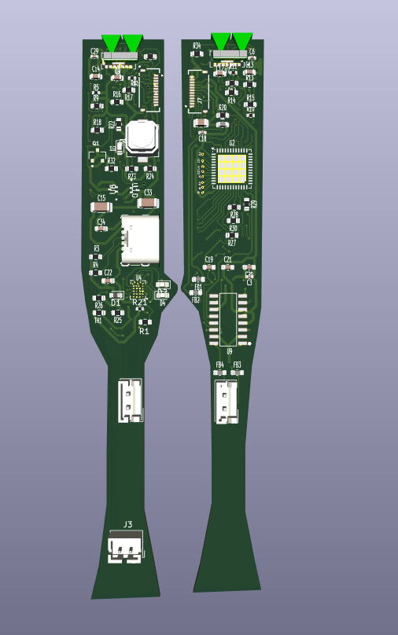

# Pagtingin (Obstacle Detecting Glasses)

Image 1. Pagtingin Prototype V1

## Prototype Demonstration
https://www.youtube.com/watch?v=mGvRfI-a0dM

## Project Aims

The Pagtingin obstacle detecting glasses aims to help visually impaired people to easily detect obstacles in front of them through innovative glasses. While traditional walking sticks indeed help in detecting obstacles on the ground, they often fail to identify objects at chest or head level, such as low-hanging branches, open cabinets, or protruding signs. 

Hence, Pagtingin aims to aid this limitation and ensure a safe journey of navigation. Whether indoors or outdoors, the device will be able to identify potential hazards through a Time-of-Flight sensor and send real-time audio feedback, which helps users to be much more confident and safe in the user's day-to-day lives.

(+ I wanna try walking blindly sometimes)

Courtesy of Freepik

## PCB Version

Image 2. PCB Front View

Image 3. PCB Back View

## Panelized Version

Image 3. Panelized PCB Front View

Image 4. Panelized PCB Back View

## CAD

### Glasses Frame

Image 5. Glasses Frame Front View

Image 6. Glasses Frame Top View

Image 7. Glasses Frame Back View

### Temples

Image 8. Glasses Temple Side View

Image 9. Glasses Temple Top View

Image 10. Glasses Temple Bottom View

## 3D Printing
In terms of 3D printing, it might be better to print this in resin since the glasses frame will require precise dimensions. You may be able to print this in FDM, but it is recommended for the parameters to be as precise as possible.

## BOM
https://docs.google.com/spreadsheets/d/17i14ZackUdraa6Qyv3OiZuTYL3An4RdyssWMnPNHM5A/edit?usp=sharing

## Firmware
Still in progress. You may see previous prototypes in the folder for previous version's firmware. But for the firmware, I am planning to use the ESP-IDF in programming it. I chose the ESP-IDF because it allows full control over the ESP32-PICO-D4's peripherals and such. (also because I wanna challenge myself)